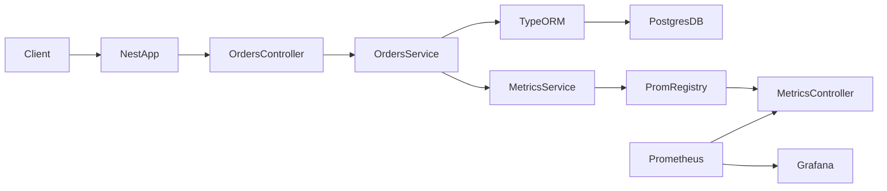

## Metrics API – Architecture & Metrics Flow

### Overview

This document explains how the **Metrics API** works end‑to‑end:

- How an **HTTP request** is handled (controllers, services, TypeORM, Postgres).
- How **business metrics** are updated with `prom-client`.
- How all metrics are **exposed via `/metrics`** in Prometheus format.
- How **Prometheus and Grafana** fit into the picture.

---

## High‑level architecture



- Left: HTTP **requests** flow through NestJS to controllers and services, then to **Postgres** via TypeORM.
- Middle: Services **update metrics** through `MetricsService` which wraps `prom-client`.
- Right: **Prometheus** scrapes `/metrics`, and **Grafana** visualizes the time‑series data from Prometheus.

---

## HTTP request lifecycle

### 1. NestJS bootstrap

File: `src/main.ts`

- Creates the Nest app and starts listening on a port:

```ts
const app = await NestFactory.create<NestExpressApplication>(AppModule);
app.useGlobalPipes(new ValidationPipe({ whitelist: true, transform: true }));

const config = new DocumentBuilder()
  .setTitle('Metrics API')
  .setDescription('API for learning metrics, Prometheus and Grafana (orders & payments)')
  .setVersion('1.0')
  .build();

const document = SwaggerModule.createDocument(app, config);
SwaggerModule.setup('api', app, document);

const port = process.env.PORT || 5000;
await app.listen(port);
```

- `ValidationPipe` ensures request bodies match DTOs.
- Swagger UI is available at `/api`.

### 2. Module and database wiring

File: `src/app.module.ts`

- Configures **environment variables** and **Postgres** via TypeORM:

```ts
imports: [
  ConfigModule.forRoot({ isGlobal: true }),
  TypeOrmModule.forRootAsync({
    inject: [ConfigService],
    useFactory: (config: ConfigService) => ({
      type: 'postgres',
      host: config.get<string>('POSTGRES_HOST', 'localhost'),
      port: parseInt(config.get<string>('POSTGRES_PORT', '5432'), 10),
      username: config.get<string>('POSTGRES_USER', 'metrics'),
      password: config.get<string>('POSTGRES_PASSWORD', 'metrics'),
      database: config.get<string>('POSTGRES_DB', 'metrics'),
      entities: [Order, Payment],
      synchronize: true,
    }),
  }),
  MetricsModule,
  OrdersModule,
  PaymentsModule,
],
```

- Postgres connection details are read from `.env`:

```env
POSTGRES_HOST=localhost
POSTGRES_PORT=5432
POSTGRES_USER=metrics
POSTGRES_PASSWORD=metrics
POSTGRES_DB=metrics
```

---

## Example: `POST /orders` end‑to‑end

### 1. Incoming HTTP request

- Client sends:

```http
POST /orders
Content-Type: application/json

{
  "customerId": "C1",
  "valueEur": 99.99,
  "description": "First order"
}
```

- NestJS receives this on the port configured in `main.ts`.

### 2. Routing to controller

File: `src/orders/orders.controller.ts`

- Nest maps the route (`POST /orders`) to `OrdersController.create()`:

```ts
@Post()
@ApiOperation({ summary: 'Create a new order' })
@ApiResponse({ status: 201, description: 'Order created', type: OrderResponseDto })
@ApiResponse({ status: 400, description: 'Bad request' })
async create(@Body() dto: CreateOrderDto): Promise<OrderResponseDto> {
  const order = await this.ordersService.create(dto);
  return this.toResponse(order);
}
```

- The request body is bound to `CreateOrderDto` and validated by `ValidationPipe`.
- If validation fails → Nest returns **400** without hitting the service.

### 3. Business logic and database write

File: `src/orders/orders.service.ts`

- The service uses **TypeORM** to write to Postgres and updates metrics:

```ts
@Injectable()
export class OrdersService {
  constructor(
    private readonly metrics: MetricsService,
    @InjectRepository(Order) private readonly ordersRepo: Repository<Order>,
  ) {}

  async create(dto: CreateOrderDto): Promise<Order> {
    const order = this.ordersRepo.create({
      customerId: dto.customerId,
      valueEur: dto.valueEur,
      description: dto.description,
    });
    await this.ordersRepo.save(order);

    this.metrics.ordersCreatedTotal.inc({ status: 'success' });
    this.metrics.orderValueEur.observe({ status: 'success' }, dto.valueEur);

    return order;
  }

  async findOne(id: string): Promise<Order> {
    const order = await this.ordersRepo.findOneBy({ id });
    if (!order) throw new NotFoundException(`Order ${id} not found`);
    return order;
  }

  async findAll(): Promise<Order[]> {
    return this.ordersRepo.find();
  }
}
```

- **Database write**:
  - `ordersRepo.create(...)` constructs a new `Order` entity.
  - `ordersRepo.save(order)` inserts a row into the `orders` table.
- **Metrics update**:
  - `orders_created_total{status="success"}` is incremented by 1.
  - `order_value_eur_bucket{status="success", ...}` and related histogram series are updated with the new value.

### 4. Response back to client

- Controller converts the entity to a response DTO and Nest returns a **201** JSON response like:

```json
{
  "id": "uuid-generated",
  "customerId": "C1",
  "valueEur": 99.99,
  "description": "First order",
  "createdAt": "2026-03-01T12:00:00.000Z"
}
```

Exactly the same pattern applies to **payments**:

- `POST /payments` → `PaymentsController` → `PaymentsService` → `Payment` entity + metrics (`payments_processed_total`, `payment_amount_eur`).

---

## How metrics are defined and updated

### Metrics service

File: `src/metrics/metrics.service.ts`

- Centralized definition of all metrics using `prom-client`:

```ts
@Injectable()
export class MetricsService {
  private readonly registry: Registry;

  readonly ordersCreatedTotal: Counter;
  readonly paymentsProcessedTotal: Counter;
  readonly orderValueEur: Histogram;
  readonly paymentAmountEur: Histogram;

  constructor() {
    this.registry = new Registry();
    collectDefaultMetrics({ register: this.registry, prefix: 'metrics_' });

    this.ordersCreatedTotal = new Counter({
      name: 'orders_created_total',
      help: 'Total number of orders created',
      labelNames: ['status'],
      registers: [this.registry],
    });

    this.paymentsProcessedTotal = new Counter({
      name: 'payments_processed_total',
      help: 'Total number of payments processed',
      labelNames: ['status'],
      registers: [this.registry],
    });

    this.orderValueEur = new Histogram({
      name: 'order_value_eur',
      help: 'Order value in EUR',
      labelNames: ['status'],
      buckets: [10, 25, 50, 100, 250, 500, 1000, 2500, 5000],
      registers: [this.registry],
    });

    this.paymentAmountEur = new Histogram({
      name: 'payment_amount_eur',
      help: 'Payment amount in EUR',
      labelNames: ['status'],
      buckets: [10, 25, 50, 100, 250, 500, 1000, 2500, 5000],
      registers: [this.registry],
    });
  }

  async getMetrics(): Promise<string> {
    return this.registry.metrics();
  }

  getContentType(): string {
    return this.registry.contentType;
  }
}
```

- **Default metrics**:
  - `collectDefaultMetrics(...)` adds Node.js and process metrics (CPU, memory, etc.) with prefix `metrics_`.
- **Custom business metrics**:
  - `orders_created_total{status="success|failed"}`
  - `payments_processed_total{status="success|declined|error"}`
  - `order_value_eur` and `payment_amount_eur` histograms with `status` labels.

### When metrics are updated

- In `OrdersService.create()`:
  - `ordersCreatedTotal.inc({ status: 'success' });`
  - `orderValueEur.observe({ status: 'success' }, dto.valueEur);`
- In `PaymentsService.process()`:
  - Generates a simulated `status` (`success`, `declined`, or `error`).
  - Increments `payments_processed_total{status=...}`.
  - Observes the payment amount in `payment_amount_eur{status=...}`.

This means **every successful or failed business action leaves a trace in the metrics**, which you can query later.

---

## How `/metrics` exposes all metrics

### Metrics controller

File: `src/metrics/metrics.controller.ts`

```ts
@ApiExcludeController()
@Controller('metrics')
export class MetricsController {
  constructor(private readonly metricsService: MetricsService) {}

  @Get()
  @Header('Content-Type', 'text/plain; charset=utf-8')
  async getMetrics(): Promise<string> {
    return this.metricsService.getMetrics();
  }
}
```

- `GET /metrics`:
  - Calls `metricsService.getMetrics()`, which in turn calls `registry.metrics()`.
  - Returns a **plain text** payload in Prometheus exposition format.
- `@ApiExcludeController()` hides `/metrics` from Swagger UI (it’s mainly for Prometheus, not humans).

### Example output

After a few requests, you might see lines like:

```text
# HELP orders_created_total Total number of orders created
# TYPE orders_created_total counter
orders_created_total{status="success"} 3
orders_created_total{status="failed"} 1

# HELP payment_amount_eur Payment amount in EUR
# TYPE payment_amount_eur histogram
payment_amount_eur_bucket{status="success",le="10"} 0
payment_amount_eur_bucket{status="success",le="25"} 1
...
payment_amount_eur_sum{status="success"} 250.5
payment_amount_eur_count{status="success"} 3
```

---

## Prometheus and Grafana

### Prometheus

- You configure a job in Prometheus to scrape the API:

```yaml
scrape_configs:
  - job_name: 'metrics-api'
    static_configs:
      - targets: ['host.docker.internal:5000']  # or appropriate host:port
```

- At each scrape interval, Prometheus:
  1. Calls `GET /metrics`.
  2. Parses the text.
  3. Stores all numeric series (`orders_created_total`, `payment_amount_eur`, etc.) as time‑series data.

### Grafana

- Grafana is configured with Prometheus as a data source.
- You can build dashboards and alerts using PromQL, for example:

- **Order creation rate**:

```promql
sum(rate(orders_created_total{status="success"}[5m]))
```

- **95th percentile order value**:

```promql
histogram_quantile(0.95, sum(rate(order_value_eur_bucket[5m])) by (le))
```

- **Payment error rate**:

```promql
sum(rate(payments_processed_total{status="error"}[5m]))
/
sum(rate(payments_processed_total[5m]))
```

---

## Summary

- **API side**:
  - Requests are routed by NestJS to controllers and services.
  - Services use TypeORM to persist `Order` and `Payment` entities in Postgres.
  - During each business operation, `MetricsService` updates counters and histograms via `prom-client`.

- **Metrics exposure**:
  - `GET /metrics` returns all registered metrics in Prometheus text format.

- **Observability stack**:
  - Prometheus periodically scrapes `/metrics`.
  - Grafana visualizes and alerts on those metrics.

